# KabuKids Architecture Documentation

## Overview

KabuKids is a Python-based desktop application designed to help children engage with meals through an AI-powered conversational companion named "Kabu". The application tracks meal sessions, records conversations, analyzes facial expressions, and provides personalized recommendations for parents and caregivers.

## Technology Stack

### Core Framework
- **Kivy 2.0+**: Cross-platform GUI framework for Python
- **Python 3.x**: Primary programming language

### AI/ML Components
- **Ollama (qwen2.5:7b)**: Local LLM for conversational AI
- **OpenAI Whisper (tiny)**: Speech-to-text transcription
- **Kokoro TTS**: Text-to-speech synthesis
- **Transformers (Hugging Face)**: 
  - `trpakov/vit-face-expression`: Facial expression recognition
  - `openai/whisper-tiny`: Automatic speech recognition
- **OpenCV**: Computer vision for face detection and camera capture

### Database
- **MongoDB Atlas**: Cloud-hosted NoSQL database
- **PyMongo**: MongoDB Python driver

### Audio Processing
- **sounddevice**: Real-time audio capture and playback
- **numpy**: Audio signal processing

### Additional Libraries
- **Pillow (PIL)**: Image processing
- **certifi**: SSL certificate management for MongoDB connections

## Project Structure

```
KabuKids/
├── app_main.py                 # Main application entry point
├── KabuKids.py                 # Legacy main file (contains duplicate code)
├── KabuKids.kv                 # Root Kivy layout file
├── db.py                       # Database connection and collections
├── colors.py                   # Color theme definitions
├── requirement.txt             # Python dependencies
│
├── mainsession/                # AI/ML conversation engine
│   ├── config.py              # Configuration constants
│   ├── Kabu_V1.py             # Standalone conversation runner
│   ├── llm.py                 # LLM integration (Ollama)
│   ├── stt.py                 # Speech-to-text (Whisper)
│   ├── tts.py                 # Text-to-speech (Kokoro)
│   ├── fer.py                 # Facial expression recognition
│   ├── mongodb.py             # Database operations
│   └── utils.py               # Utility functions (history, parsing)
│
├── screens/                    # UI Screen modules
│   ├── auth.py                # Authentication screens (Login, Signup)
│   ├── profile.py             # User profile management
│   ├── dashboard_report.py    # Dashboard and report viewing
│   ├── meal_flow.py           # Meal tracking flow (portions, ingredients, session)
│   ├── *.kv                   # Kivy layout files for each screen
│   └── icons/                 # UI icons
│
├── services/                   # Business logic layer
│   └── models.py              # Data models and state management
│
└── widgets/                    # Reusable UI components
    └── meal_item.py           # Meal list item widget
```

## System Architecture Overview

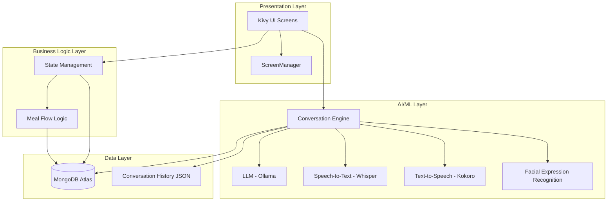

## Architecture Layers

### 1. Presentation Layer (Kivy UI)

The application uses Kivy's ScreenManager pattern for navigation between different screens:

#### Screen Navigation Flow

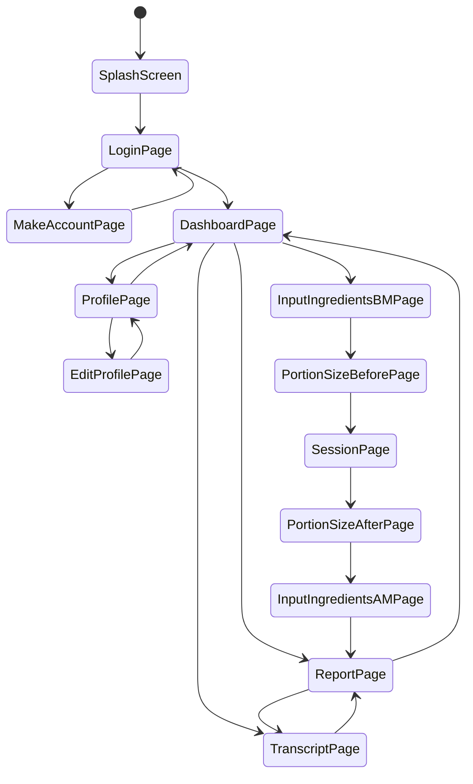

#### Screen Hierarchy
- **SplashScreen**: Initial loading screen
- **LoginPage**: User authentication
- **MakeAccountPage**: New user registration
- **DashboardPage**: Main hub showing meal history
- **ProfilePage**: View user profile
- **EditProfilePage**: Edit user profile
- **SessionPage**: Real-time conversation with Kabu
- **PortionSizeBeforePage**: Capture portion size before meal
- **PortionSizeAfterPage**: Capture portion size after meal
- **InputIngredientsBMPage**: Input ingredients before meal
- **InputIngredientsAMPage**: Input ingredients after meal
- **ReportPage**: View detailed meal report
- **TranscriptPage**: View conversation transcript

#### UI Architecture Pattern
- **MVVM-like**: Screens bind to properties that update automatically
- **Event-driven**: User interactions trigger callbacks
- **State management**: Global state via `App.current_user` and `CURRENT_MEAL`

### 2. Business Logic Layer

#### State Management (`services/models.py`)
- **CURRENT_MEAL**: Global dictionary tracking current meal session
  - Contains: user_id, date, times, transcript, summary, suggestions, food lists, images
- **SAMPLE_REPORTS**: In-memory cache of meal reports
- **Functions**:
  - `init_current_meal()`: Initialize new meal session
  - `clear_current_meal()`: Reset meal state
  - `fetch_reports_for_user()`: Async fetch user's meal reports

#### Meal Flow Logic (`screens/meal_flow.py`)

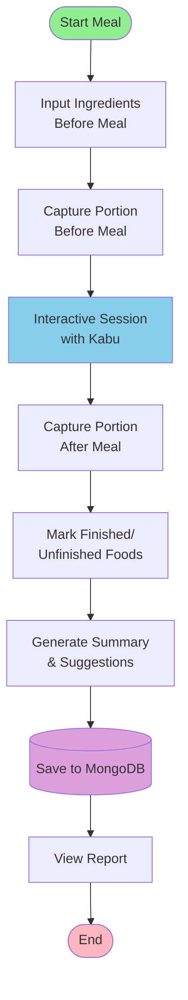

The meal tracking follows this flow:
1. **Before Meal**:
   - Input ingredients (`InputIngredientsBMPage`)
   - Capture portion size image (`PortionSizeBeforePage`)
2. **During Meal**:
   - Interactive session with Kabu (`SessionPage`)
   - Real-time conversation, emotion tracking, transcript recording
3. **After Meal**:
   - Capture portion size image (`PortionSizeAfterPage`)
   - Mark finished/unfinished foods (`InputIngredientsAMPage`)
   - Generate summary and suggestions
   - Save to MongoDB

### 3. AI/ML Layer (`mainsession/`)

#### Conversation Engine (`mainsession/Kabu_V1.py` & `screens/meal_flow.py`)

**Session Loop Architecture**:

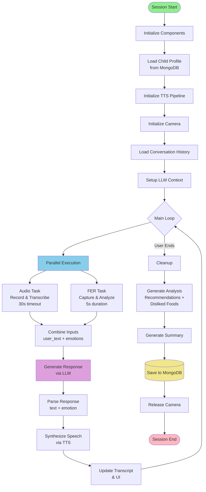

**Session Loop Steps**:
1. **Initialize**:
   - Load child profile from MongoDB
   - Initialize TTS pipeline (Kokoro)
   - Initialize camera (OpenCV)
   - Load conversation history
   - Set up LLM context with child preferences

2. **Main Loop** (runs in background thread):
   - Parallel execution:
     * Audio Task: Record and transcribe speech (30s timeout)
     * FER Task: Capture and analyze facial expressions (5s)
   - Combine inputs: user_text + emotions
   - Generate response via LLM
   - Parse response (text + emotion)
   - Synthesize speech via TTS
   - Update transcript
   - Update UI (emotion image)

3. **Cleanup**:
   - Generate analysis (recommendations + disliked foods)
   - Generate summary
   - Save meal document to MongoDB
   - Release camera

#### AI/ML Component Interactions

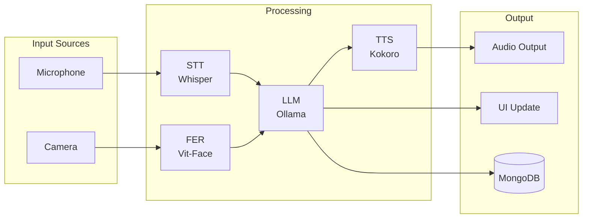

#### Components:

**LLM Integration (`mainsession/llm.py`)**:
- Uses Ollama with `qwen2.5:7b` model
- Maintains conversation history in JSON file
- Implements history trimming (6000 char limit)
- Fallback questions if LLM fails

**Speech-to-Text (`mainsession/stt.py`)**:
- Uses OpenAI Whisper (tiny model) via Transformers
- Real-time audio capture with silence detection
- VAD (Voice Activity Detection) using RMS threshold
- Timeout handling (30s wait, 2s silence to stop)

**Text-to-Speech (`mainsession/tts.py`)**:
- Uses Kokoro TTS pipeline
- Voice: `af_sky` (child-friendly voice)
- Real-time audio playback via sounddevice

**Facial Expression Recognition (`mainsession/fer.py`)**:
- Uses `trpakov/vit-face-expression` model
- OpenCV Haar Cascade for face detection
- Samples frames over 5 seconds
- Returns top 2 most common emotions

**Conversation History (`mainsession/utils.py`)**:
- JSON-based persistence
- History trimming to prevent context overflow
- System message injection
- Response parsing (extracts Kabu text and emotions)

### 4. Data Layer

#### Database Schema

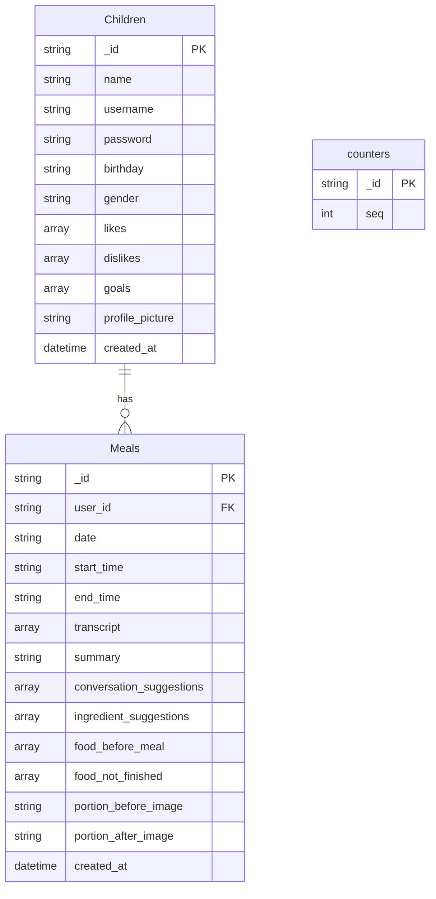

**MongoDB Collections**:

1. **Children Collection**:
```python
{
    "_id": str (UUID),
    "name": str,
    "username": str,
    "password": str,  # Note: Should be hashed in production
    "birthday": str (MM/DD/YYYY),
    "gender": str,
    "likes": [str],  # Topics child likes
    "dislikes": [str],  # Topics/phrases to avoid
    "goals": [str],  # Child's goals
    "profile_picture": str (file path),
    "created_at": datetime
}
```

2. **Meals Collection**:
```python
{
    "_id": str (UUID),
    "user_id": str,
    "date": str (e.g., "January 15, 2024"),
    "start_time": str (e.g., "11:30 AM"),
    "end_time": str (e.g., "12:00 PM"),
    "transcript": [
        {
            "role": str ("User" or "Kabu"),
            "text": str,
            "emotion": str,
            "time": str,
            "emotion_displayed": [str]
        }
    ],
    "summary": str,
    "conversation_suggestions": [str],
    "ingredient_suggestions": [str],
    "food_before_meal": [str],
    "food_not_finished": [str],
    "portion_before_image": str (file path),
    "portion_after_image": str (file path),
    "created_at": datetime
}
```

3. **counters Collection** (for sequential IDs):
```python
{
    "_id": str (counter name),
    "seq": int
}
```

#### Database Operations (`db.py` & `mainsession/mongodb.py`)

- **Connection**: MongoDB Atlas with TLS/SSL
- **Operations**:
  - `insert_child()`: Create new child profile
  - `get_child_by_id()`: Retrieve child profile
  - `insert_meal()`: Save meal session
  - `find_meal()`: Retrieve meal by ID
  - `fetch_reports_for_user()`: Get all meals for a user

## Data Flow

### User Authentication Flow

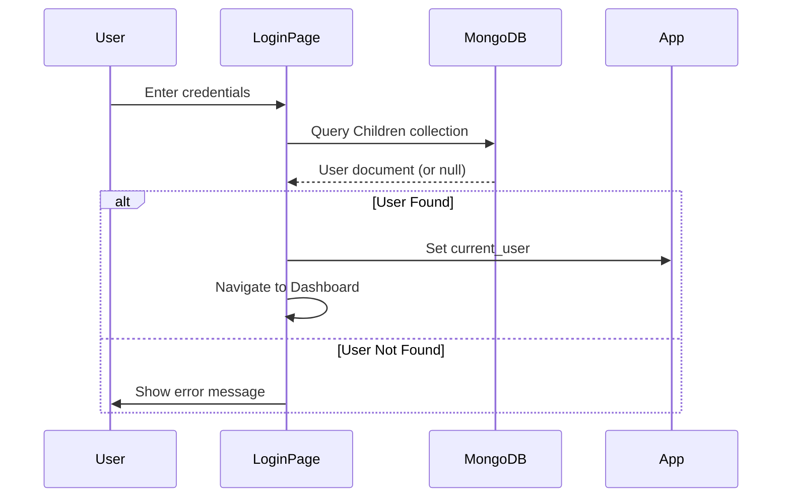

### Meal Session Flow

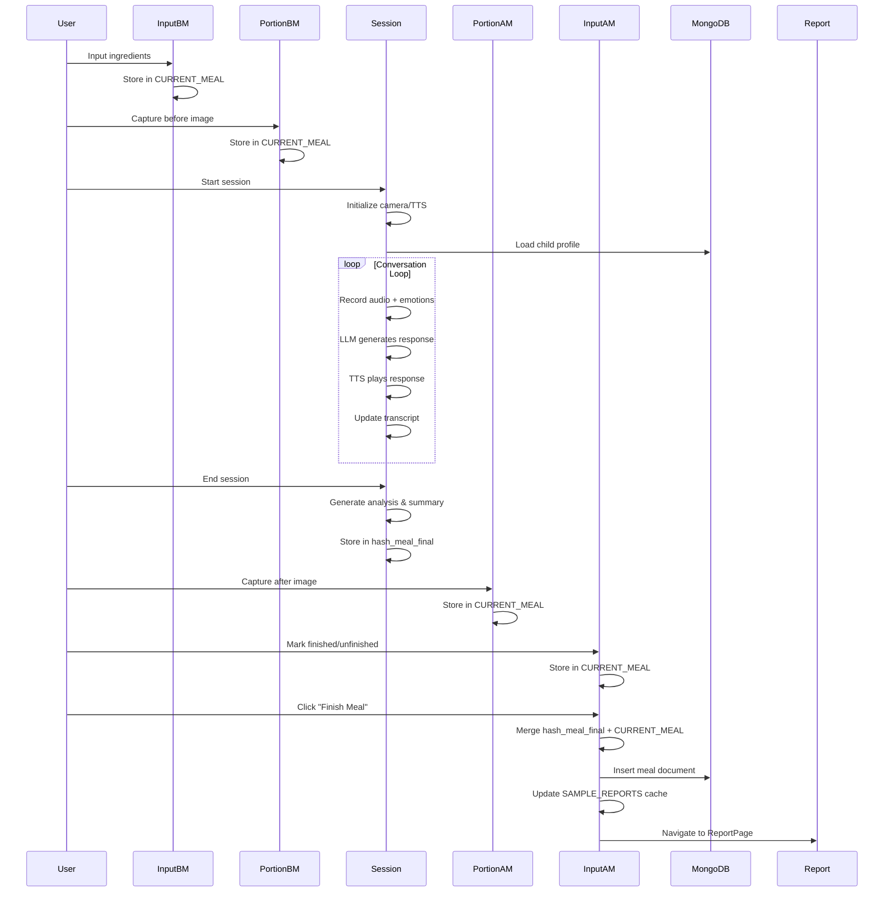

### Report Viewing Flow

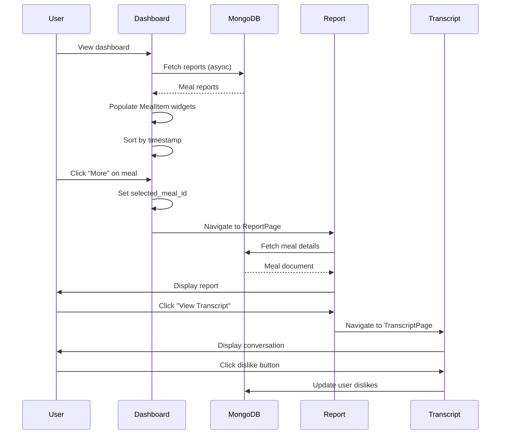

## Key Design Patterns

### Architecture Pattern Overview

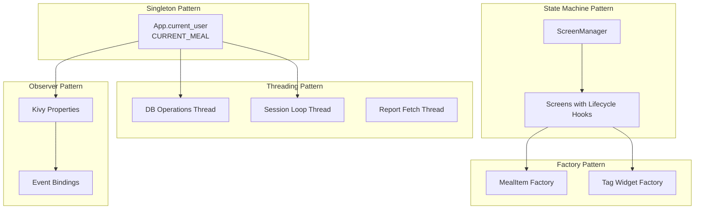

### 1. Singleton Pattern
- `App.current_user`: Single source of truth for logged-in user
- `CURRENT_MEAL`: Global meal state during session

### 2. Observer Pattern
- Kivy properties automatically update UI when values change
- Event bindings for user interactions

### 3. Threading Pattern
- Background threads for:
  - Database operations (non-blocking UI)
  - Session loop (audio + video processing)
  - Report fetching

### 4. State Machine Pattern
- ScreenManager manages navigation states
- Each screen has lifecycle hooks (`on_enter`, `on_leave`, `on_pre_enter`)

### 5. Factory Pattern
- MealItem widgets created dynamically from report data
- Tag widgets created on-demand in profile screens

## Security Considerations

### Current State
- Passwords stored in plaintext (should be hashed)
- MongoDB credentials in code (should use environment variables)
- No input validation/sanitization
- No rate limiting on authentication

### Recommendations
- Hash passwords using bcrypt or similar
- Move all secrets to environment variables
- Implement input validation
- Add session timeout
- Implement CSRF protection for web components (if applicable)

## Performance Considerations

### Performance Architecture

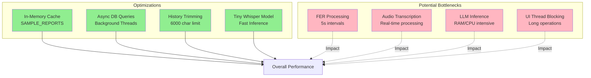

### Optimizations
- **Caching**: SAMPLE_REPORTS in-memory cache
- **Async Operations**: Database queries in background threads
- **History Trimming**: LLM context limited to 6000 characters
- **Model Selection**: Using "tiny" Whisper model for faster inference

### Potential Bottlenecks
- **Camera Processing**: FER runs every 5 seconds (could be optimized)
- **Audio Processing**: Real-time transcription may lag on slower hardware
- **LLM Inference**: Local Ollama model requires sufficient RAM/CPU
- **UI Thread Blocking**: Long operations should remain in background threads

## Configuration

### Environment Variables (`mainsession/config.py`)
- `SAMPLE_RATE`: Audio sample rate (default: 16000)
- `DURATION`: Audio recording duration (default: 10)
- `PROCESS_TIMEOUT`: Processing timeout (default: 3.0)
- `CAMERA_INDEX`: Camera device index (default: 0)
- `HISTORY_FILE`: Conversation history file path
- `OPENROUTER_API_KEY`: (Optional) API key for OpenRouter
- `MONGODB_URI`: MongoDB connection string

### Color Theme (`colors.py`)
- PRIMARY_COLOR: White
- SECONDARY_COLOR: Dark green
- ACCENT_COLOR: Yellow
- DARK_COLOR: Dark brown
- LIGHT_COLOR: Light green
- SUPER_LIGHT: Very light gray

## Error Handling

### Current Approach
- Try-except blocks around critical operations
- Fallback values for missing data
- Error messages via Popup widgets
- Logger for debugging

### Areas for Improvement
- Centralized error handling
- User-friendly error messages
- Retry logic for network operations
- Graceful degradation when ML models fail

## Testing Considerations

### Current State
- No automated tests visible in codebase
- Manual testing likely used

### Recommended Tests
- Unit tests for utility functions
- Integration tests for database operations
- Mock tests for AI/ML components
- UI tests for screen navigation
- End-to-end tests for meal flow

## Deployment

### Requirements
- Python 3.x
- MongoDB Atlas account
- Ollama installed locally with qwen2.5:7b model
- Camera and microphone access
- Sufficient RAM for ML models (recommended: 8GB+)

### Build Process
1. Install dependencies: `pip install -r requirement.txt`
2. Install Ollama and pull model: `ollama pull qwen2.5:7b`
3. Set environment variables (MongoDB URI, etc.)
4. Run: `python app_main.py`

### Distribution
- Could be packaged with PyInstaller or similar
- Requires bundling ML models or download on first run
- Camera/microphone permissions needed

## Future Enhancements

### Enhancement Roadmap

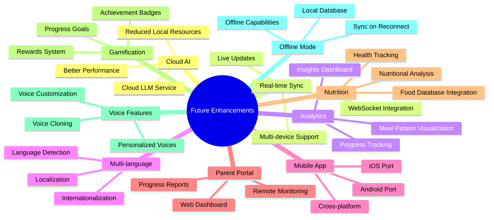

### Potential Improvements
1. **Cloud AI**: Move LLM to cloud service for better performance
2. **Real-time Sync**: WebSocket for real-time updates
3. **Analytics Dashboard**: Visualize meal patterns over time
4. **Multi-language Support**: Internationalization
5. **Mobile App**: Port to Android/iOS using Kivy
6. **Parent Portal**: Web dashboard for parents
7. **Nutritional Analysis**: Integrate food database for nutrition info
8. **Gamification**: Rewards system for meal completion
9. **Voice Cloning**: Personalized Kabu voice per child
10. **Offline Mode**: Local database fallback when offline

## Dependencies Summary

### Core
- kivy>=2.0.0
- pymongo>=4.3
- certifi>=2023.5.7

### AI/ML
- transformers>=4.35.2
- torch>=2.0.0
- ollama>=0.1.0
- kokoro>=0.1.0
- openai>=0.27.0

### Audio/Video
- sounddevice>=0.4.6
- soundfile>=0.12.1
- opencv-python>=4.7.0
- numpy>=1.24
- Pillow>=9.5.0

### Utilities
- python-dotenv>=1.0.0
- dnspython>=2.3.0

## Conclusion

KabuKids is a sophisticated application combining modern AI/ML technologies with a user-friendly interface to create an engaging meal-time companion for children. The architecture follows a layered approach with clear separation of concerns, making it maintainable and extensible. The integration of real-time conversation, emotion recognition, and meal tracking provides a comprehensive solution for encouraging healthy eating habits in children.

