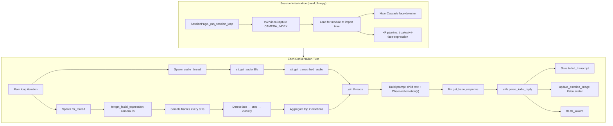
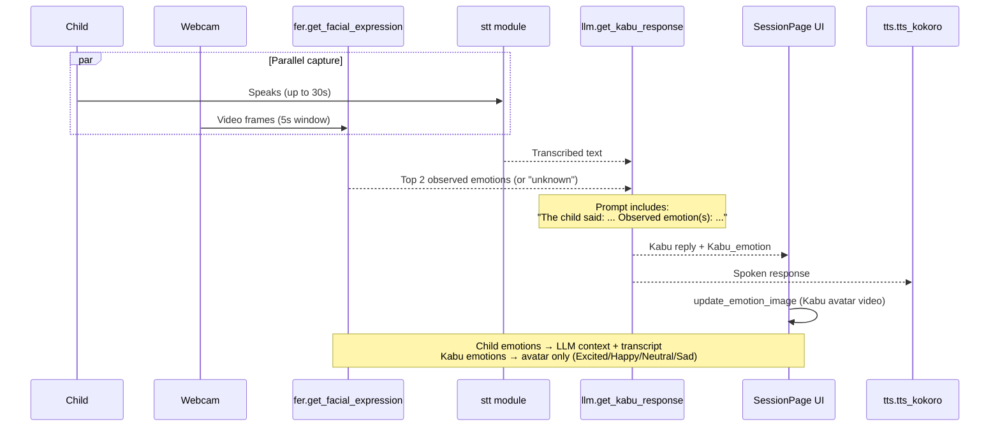

# Facial Expression Recognition (FER) — KabuKids

This document describes how facial expression recognition is implemented in the KabuKids application.

---

## FER Model Used

The app uses **`trpakov/vit-face-expression`** — a **Vision Transformer (ViT)** loaded via Hugging Face Transformers as an `image-classification` pipeline.

```python
# mainsession/fer.py
face_cascade = cv2.CascadeClassifier(cv2.data.haarcascades + 'haarcascade_frontalface_default.xml')
fer_pipe = pipeline("image-classification", model="trpakov/vit-face-expression")
```

Face detection is handled separately by **OpenCV Haar Cascade** (`haarcascade_frontalface_default.xml`).

---

## How FER Fits In

FER runs **in parallel with speech capture** during each conversation turn. Detected child emotions are sent to the LLM as context. Kabu's own displayed emotions come from the LLM (not FER) and drive avatar videos.

---

## Architecture Diagram



---

## FER Pipeline Detail (`mainsession/fer.py`)

```mermaid
flowchart LR
    subgraph Input
        CAM[OpenCV Camera Frame BGR]
    end

    subgraph Detection
        CAM --> GRAY[Convert to Grayscale]
        GRAY --> HAAR[Haar Cascade detectMultiScale]
        HAAR -->|No face| SKIP[Skip frame, wait 0.1s]
        HAAR -->|Face found| PICK[Largest face by area]
        PICK --> CROP[Crop face region]
        CROP --> PIL[PIL RGB image]
    end

    subgraph Classification
        PIL --> VIT[trpakov/vit-face-expression]
        VIT --> LABEL[Top label per frame]
        LABEL --> COLLECT[Collect labels over 5 seconds]
    end

    subgraph Output
        COLLECT --> COUNTER[collections.Counter]
        COUNTER --> TOP2[Return top 2 most common labels]
        TOP2 --> OUT["e.g. ['happy', 'neutral']"]
    end
```



### Key Parameters

| Setting | Value | Location |
|--------|-------|----------|
| Model | `trpakov/vit-face-expression` | `mainsession/fer.py` |
| Face detector | Haar Cascade (min face 80×80) | `mainsession/fer.py` |
| Capture duration | 5.0 seconds | `screens/meal_flow.py`, `mainsession/Kabu_V1.py` |
| Sample interval | 0.1 seconds (~50 frames max) | `mainsession/fer.py` |
| Camera index | `CAMERA_INDEX` env (default `0`) | `mainsession/config.py` |
| FER thread timeout | 12 seconds | `screens/meal_flow.py` |
| Audio thread timeout | 35 seconds | `screens/meal_flow.py` |

---

## Data Flow (Child vs Kabu Emotions)



---

## End-to-End Turn Flow

```
┌─────────────────────────────────────────────────────────────┐
│                    SessionPage (meal_flow.py)               │
└─────────────────────────────────────────────────────────────┘
                              │
              ┌───────────────┴───────────────┐
              ▼                               ▼
     ┌─────────────────┐             ┌─────────────────┐
     │  audio_thread   │             │   fer_thread    │
     │  STT (30s max)  │             │  FER (5s window)│
     └────────┬────────┘             └────────┬────────┘
              │                               │
              │  "I love this!"               │  ["happy", "neutral"]
              └───────────────┬───────────────┘
                              ▼
              LLM prompt: "The child said: \"I love this!\".
                          Observed emotion(s): happy, neutral."
                              │
                              ▼
              Kabu reply + Kabu_emotion → TTS + avatar video
                              │
                              ▼
              full_transcript → MongoDB / reports
```

---

## Relevant Files

| File | Role |
|------|------|
| `mainsession/fer.py` | Core FER logic (face detect, classify, aggregate) |
| `screens/meal_flow.py` | Production UI session — spawns `fer_thread`, passes emotions to LLM |
| `mainsession/Kabu_V1.py` | CLI prototype — same parallel audio + FER pattern |
| `mainsession/config.py` | Camera index and session config |
| `SYSTEM_ARCHITECTURE.md` | Broader system architecture including FER |

---

## Design Notes

### Two Emotion Systems

- **Child (FER):** Raw labels from `vit-face-expression` (e.g. angry, disgust, fear, happy, neutral, sad, surprise).
- **Kabu (LLM):** Constrained to `Excited`, `Happy`, `Neutral`, `Sad` — drives `screens/KabuEmotions/*.mp4`.

### Graceful Degradation

- If the Hugging Face pipeline fails to load → `fer_pipe = None`, FER returns `[]`.
- If no face is detected → empty list → LLM sees `"unknown"`.
- If the camera fails to open → FER thread skips analysis.

### No Live Child Emotion UI

Child emotions are stored in `full_transcript` and shown in reports/dashboards. They are not used to drive a live avatar for the child — only Kabu's LLM-assigned emotions update the on-screen avatar.

### Dependencies

- `transformers`
- `torch`
- `opencv-python`
- `Pillow`

See `requirement.txt` for version constraints.

---

## 5.2 Feature Extraction and Algorithm Selection

**SO2:** What features can be extracted from the chosen/selected modality, and what algorithm can be used for the extraction?

**Selected modality:** Live webcam video frames (RGB facial imagery) captured during meal-time conversation sessions.

### Feature Inventory

| Modality | Extracted Feature | Purpose |
|----------|-------------------|---------|
| Webcam video (RGB) | Grayscale frame | Preprocessing input for face detection |
| Webcam video (RGB) | Face bounding box `(x, y, w, h)` | Localize the child's face in the frame |
| Webcam video (RGB) | Cropped face region (ROI) | Isolate facial pixels for emotion classification |
| Webcam video (RGB) | Per-frame emotion label | Classify expression on each sampled frame |
| Webcam video (RGB) | Top-2 aggregated emotion labels | Stable turn-level emotion signal for the LLM |

### Short Definition of Each Extracted Feature

| Feature | Definition |
|---------|------------|
| **Grayscale frame** | Single-channel intensity representation of the camera frame, derived from the original BGR image. Used because Haar Cascade detectors operate on luminance. |
| **Face bounding box** | A rectangle `(x, y, width, height)` marking where a frontal face was detected in the frame. |
| **Cropped face ROI** | The sub-image inside the bounding box, converted to RGB and passed to the classifier. Contains only facial pixels, reducing background noise. |
| **Per-frame emotion label** | A categorical class (e.g., `happy`, `sad`, `neutral`) assigned by the ViT model to one cropped face per sampled frame. |
| **Top-2 aggregated emotions** | The two most frequently predicted labels across all valid frames in a 5-second window, reducing single-frame noise. |

### Algorithm Used for Each Feature

- **Grayscale frame** — OpenCV `cv2.cvtColor(frame, cv2.COLOR_BGR2GRAY)` converts each webcam frame from BGR to a single-channel intensity map. Implemented in `mainsession/fer.py`.

- **Face bounding box** — OpenCV Haar Cascade (`haarcascade_frontalface_default.xml`) with `detectMultiScale(scaleFactor=1.1, minNeighbors=5, minSize=(80, 80))` scans the grayscale frame and returns candidate face rectangles. Implemented in `mainsession/fer.py`.

- **Primary face selection** — Detected faces are sorted by bounding-box area (`width × height`) and the largest face is kept. This heuristic assumes the closest face belongs to the child. Implemented in `mainsession/fer.py`.

- **Cropped face ROI** — The frame is sliced using the selected bounding box coordinates, then converted from BGR to RGB via `cv2.cvtColor` and wrapped as a PIL `Image.fromarray` for the classifier. Implemented in `mainsession/fer.py`.

- **Per-frame emotion label** — Hugging Face `trpakov/vit-face-expression` (Vision Transformer) runs as an `image-classification` pipeline. The top predicted label from each valid frame is appended to a list. Implemented in `mainsession/fer.py`.

- **Top-2 aggregated emotions** — `collections.Counter(labels).most_common(2)` counts all per-frame labels collected over the 5-second window (~0.1 s sample interval) and returns the two most frequent classes. Implemented in `mainsession/fer.py`.

### Rationale for Algorithm Selection

| Choice | Rationale |
|--------|-----------|
| **Haar Cascade for face detection** | Lightweight, runs locally without GPU, fast enough for real-time sampling (~10 fps). Suitable for a desktop Kivy app where latency matters. |
| **Largest-face heuristic** | In a single-child meal setting, the closest/largest face is most likely the child. Avoids misclassification from background faces. |
| **`trpakov/vit-face-expression` (ViT)** | Pre-trained Vision Transformer fine-tuned for facial expression recognition. Accessible via Hugging Face `transformers` with minimal custom code. Strong accuracy on standard FER label sets compared to hand-crafted features. |
| **Top-2 temporal aggregation** | Single frames are noisy (lighting, head movement, mid-blink). Voting over ~50 samples in 5 seconds yields a more stable emotion signal for LLM context. |
| **Parallel FER + STT threads** | Face analysis (5 s) and speech capture (up to 30 s) run concurrently so emotion extraction does not block the conversation loop. |

### Sample Extracted Outputs

**Per-turn FER output:**

```python
["happy", "neutral"]      # top 2 labels over 5s window
["disgust", "sad"]        # example when child reacts negatively
[]                        # no face detected or pipeline unavailable
```

**LLM prompt example:**

```
The child said: "But it looks weird... like a cursed spirit or something."
Observed emotion(s): disgust, sad.
```

**Stored in session transcript:**

```json
{
  "speaker": "child",
  "text": "But it looks weird... like a cursed spirit or something.",
  "emotions": ["disgust", "sad"],
  "timestamp": "2025-10-20T12:34:00+00:00"
}
```

ViT model label set typically includes: **angry, disgust, fear, happy, neutral, sad, surprise**.

### Validation

Validation of the FER extraction process is primarily operational rather than quantitative. During each session, `fer_task` logs its start, finish, and detected emotion labels in `screens/meal_flow.py`, providing a runtime trace that extraction ran as expected. The pipeline is designed to fail gracefully: if no face is detected, a frame cannot be read, or the Hugging Face model fails to load (`fer_pipe` is wrapped in try/except), the function returns an empty list and the LLM receives `"unknown"` instead of crashing the session. Before FER runs, the camera is verified with `cv2.VideoCapture.isOpened()`, and the FER thread is joined with a 12-second timeout so a hung capture cannot block the conversation loop. Extracted emotions are stored in `full_transcript` and persisted to MongoDB and reports, allowing post-session review of whether outputs align with observed behavior. The system does not include dedicated FER unit tests or a labeled benchmark dataset, so accuracy against ground truth (e.g., F1 score) has not been formally measured.
