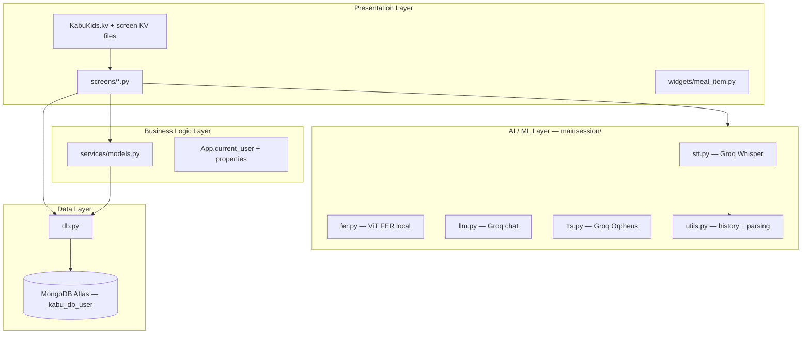
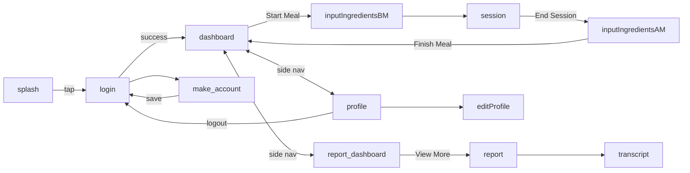
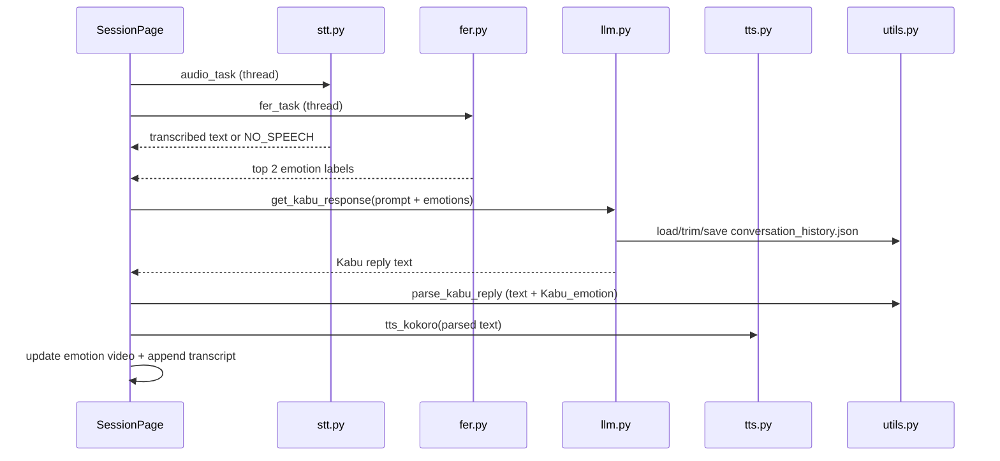

# KabuKids — System Architecture

## 1. Introduction

KabuKids is a desktop Kivy application that helps children stay engaged during meals through **Kabu**, an AI conversational companion. During a meal session the app:

- Listens to the child (speech-to-text)
- Observes facial expressions (local emotion recognition)
- Generates empathetic replies (large language model)
- Speaks back (text-to-speech)
- Records the conversation and saves a structured meal report to MongoDB

This document describes the **current** codebase as of the modular refactor (`app_main.py` + `screens/`). Older references to Ollama, local Whisper, Kokoro TTS, portion-size camera screens, and `mainsession/mongodb.py` are no longer accurate.

---

## 2. High-Level Architecture

The system is organized into four layers:



| Layer | Responsibility | Key modules |
|-------|----------------|-------------|
| Presentation | UI, navigation, user input | `KabuKids.kv`, `screens/`, `widgets/` |
| Business logic | Session state, report cache, meal lifecycle | `services/models.py`, `App` properties |
| AI / ML | Audio capture, transcription, FER, LLM, TTS | `mainsession/` |
| Data | Single MongoDB connection | `db.py` |

---

## 3. Project Structure

```
KabuKids/
├── app_main.py              # Canonical entry point
├── KabuKids.py              # Legacy monolithic duplicate (deprecated)
├── KabuKids.kv              # Root ScreenManager + #:include for all screens
├── db.py                    # MongoDB client and collection handles
├── colors.py                # Shared theme RGBA constants
├── services/
│   └── models.py            # CURRENT_MEAL, SAMPLE_REPORTS, fetch helpers
├── screens/
│   ├── auth.py              # Splash, login, registration
│   ├── dashboard_report.py  # Dashboard, reports, transcript
│   ├── profile.py           # Profile view and edit
│   ├── meal_flow.py         # Before/after meal + Kabu session
│   ├── *.kv                 # Per-screen layouts
│   ├── KabuEmotions/        # Emotion videos (neutral, happy, excited, sad, listening)
│   └── icons/               # UI assets
├── mainsession/
│   ├── config.py            # Audio/camera/history constants
│   ├── stt.py               # Speech-to-text (Groq)
│   ├── llm.py               # Chat completions (Groq)
│   ├── tts.py               # Text-to-speech (Groq)
│   ├── fer.py               # Facial expression recognition (local HF model)
│   ├── utils.py             # Conversation history + response parsing
│   └── __init__.py          # Suppresses noisy pymongo/urllib3 logs
├── widgets/
│   └── meal_item.py         # Meal report list card
├── insert_meals.py          # One-off seed script (reports_data.json → Meals)
└── test_mongo.py            # Connection smoke test
```

---

## 4. Entry Points

### Canonical: `app_main.py`

Run with:

```bash
python app_main.py
```

- Imports screen modules so Kivy `Builder` can resolve class names in KV
- Loads `KabuKids.kv`
- Sets window size to 960×540
- Defines `MultiScreenApp` with `profile_image_path` and `selected_meal_id`
- Profile image picker uses **tkinter** `filedialog` on desktop

### Deprecated: `KabuKids.py`

`KabuKids.py` is a ~1,500-line monolith that duplicates screen classes and maintains its own `CURRENT_MEAL` / `SAMPLE_REPORTS` globals instead of using `services/models.py`. Its `SessionPage` is an empty stub (`pass`), so **running `KabuKids.py` will not start the Kabu conversation loop**. Treat it as legacy code pending removal.

---

## 5. Presentation Layer

### 5.1 UI Framework

- **Kivy 2.x** with declarative `.kv` layouts
- **`WindowManager`** (`ScreenManager` subclass) with `NoTransition` for instant screen changes
- Root layout defined in `KabuKids.kv`, which `#:include`s each screen's KV file

### 5.2 Screen Registry

| Screen name (KV) | Python class | Module |
|------------------|--------------|--------|
| `splash` | `SplashScreen` | `screens/auth.py` |
| `login` | `LoginPage` | `screens/auth.py` |
| `make_account` | `MakeAccountPage` | `screens/auth.py` |
| `dashboard` | `DashboardPage` | `screens/dashboard_report.py` |
| `report_dashboard` | `ReportDashboardPage` | `screens/dashboard_report.py` |
| `report` | `ReportPage` | `screens/dashboard_report.py` |
| `transcript` | `TranscriptPage` | `screens/dashboard_report.py` |
| `profile` | `ProfilePage` | `screens/profile.py` |
| `editProfile` | `EditProfilePage` | `screens/profile.py` |
| `inputIngredientsBM` | `InputIngredientsBMPage` | `screens/meal_flow.py` |
| `session` | `SessionPage` | `screens/meal_flow.py` |
| `inputIngredientsAM` | `InputIngredientsAMPage` | `screens/meal_flow.py` |

### 5.3 Navigation Flow



**Main shell screens** (dashboard, report dashboard, profile, report, transcript) share a left **side navigation** pattern defined in their respective KV files.

**Initial screen:** `splash` (first child in `KabuKids.kv`). User taps anywhere to continue to login.

### 5.4 Reusable Widgets

| Widget | Location | Purpose |
|--------|----------|---------|
| `MealItem` | `widgets/meal_item.py` | Meal report card in report dashboard list |
| `ColoredCheckBox` | `screens/meal_flow.py` | Styled checkbox for after-meal food tracking |
| `SideNavItem`, `RoundedInput`, etc. | Various `.kv` files | KV-defined templates |

### 5.5 App-Level UI State

| Property / field | Set by | Used for |
|------------------|--------|----------|
| `App.current_user` | Login, profile save | Full Children document for all screens |
| `App.profile_image_path` | Image picker | Registration and profile picture |
| `App.selected_meal_id` | `MealItem.go_to_report` | Which meal to show on report/transcript screens |

---

## 6. Application State (`services/models.py`)

Centralized in-memory state shared across screens:

### Globals

| Variable | Type | Purpose |
|----------|------|---------|
| `CURRENT_MEAL` | `dict` | Active meal being built across before-meal → session → after-meal |
| `SAMPLE_REPORTS` | `dict[str, dict]` | Cached meal reports keyed by `_id` (populated after fetch or save) |

### Functions

| Function | Purpose |
|----------|---------|
| `init_current_meal(user_id)` | Reset `CURRENT_MEAL` with a new UUID `_id` and empty fields |
| `clear_current_meal()` | Clear the meal buffer |
| `get_logged_in_user_id(current_user)` | Normalize `Children._id` to string |
| `fetch_reports_for_user(user_id, callback)` | Query `meals_col` and invoke callback with `{id: doc}` dict |

Database reads for the report list run in a **background thread**; the callback updates UI on the main thread via Kivy `Clock`.

### Session-scoped state (`screens/meal_flow.py`)

| Variable | Purpose |
|----------|---------|
| `hash_meal_final` | Module-level dict written when `SessionPage` ends; merged into `CURRENT_MEAL` on finish |
| `SessionPage.full_transcript` | In-thread transcript before persistence |
| `SessionPage._stop_event` | Signals the session loop to exit |

---

## 7. Data Layer (`db.py`)

Single source of truth for MongoDB access. All application code imports from here.

```python
client → database "kabu_db_user"
├── children_col  →  collection "Children"
└── meals_col     →  collection "Meals"
```

| Setting | Value |
|---------|-------|
| Connection | `MONGODB_URI` environment variable (fallback default in source) |
| TLS | `certifi` CA bundle |
| API version | MongoDB Server API v1 |
| Selection timeout | 5 seconds |

### Usage by feature

| Operation | Collection | Call sites |
|-----------|------------|------------|
| Login | `Children` | `children_col.find_one({username, password})` |
| Register | `Children` | `children_col.insert_one(child_doc)` |
| Edit profile | `Children` | `children_col.update_one({"_id": ...}, {"$set": ...})` |
| Transcript dislike feedback | `Children` | `$push` to `dislikes` array |
| Fetch user meals | `Meals` | `meals_col.find({"user_id": ...})` |
| Save meal | `Meals` | `meals_col.insert_one` / `replace_one` |
| Report detail | `Meals` | `meals_col.find_one({"_id": meal_id})` |

There are no helper wrappers — screens call PyMongo collection methods directly.

---

## 8. AI / ML Pipeline (`mainsession/`)

The meal session runs a **parallel capture loop**: microphone and camera work at the same time each turn.



### 8.1 `stt.py` — Speech-to-Text

- **Provider:** Groq API (`whisper-large-v3-turbo`)
- **Input:** `sounddevice` microphone stream at 16 kHz
- **VAD:** RMS energy threshold; 2 seconds of silence ends recording; 30 s max wait for speech start
- **Returns:** numpy audio array, `"NO_SPEECH"`, or `None`
- `get_transcribed_audio(audio)` wraps PCM as in-memory WAV and posts to Groq transcription

### 8.2 `fer.py` — Facial Expression Recognition

- **Provider:** Local Hugging Face `transformers` pipeline
- **Model:** `trpakov/vit-face-expression`
- **Face detection:** OpenCV Haar cascade (`haarcascade_frontalface_default`)
- **Capture:** Samples frames for 5 seconds at 0.1 s intervals from a shared OpenCV `VideoCapture`
- **Output:** Top 2 emotion labels by frequency (e.g. `["happy", "neutral"]`), or `[]`

### 8.3 `llm.py` — Language Model

- **Provider:** Groq chat completions
- **Model:** `openai/gpt-oss-120b`
- **`get_kabu_response(prompt)`** — Multi-turn: loads `conversation_history.json`, appends user turn, trims to ~6000 chars, saves history, returns assistant text. Temperature 0.85.
- **`get_direct_response(prompt)`** — Single-turn stateless call for post-session analysis and summary. Temperature 0.3.
- **Fallback:** Random child-friendly question if API fails

### 8.4 `tts.py` — Text-to-Speech

- **Function name:** `tts_kokoro` (legacy name; does **not** use the Kokoro Python package)
- **Provider:** Groq audio speech API
- **Model:** `canopylabs/orpheus-v1-english`, voice `"austin"`
- **Playback:** `sounddevice` (`sd.play` + `sd.wait`)

### 8.5 `utils.py` — Helpers

| Area | Functions |
|------|-----------|
| Conversation history | `load_history`, `save_history`, `trim_history`, `reset_history` |
| LLM response parsing | `parse_kabu_reply`, `parse_kabu_reply_final`, `extract_topic_robust` |
| Child context | `compute_age_from(birthday)` |
| Topic memory | `switch_topic`, `increment_topic_on_user_mention`, etc. — **implemented but not wired into the session loop** |

### 8.6 `config.py`

| Constant | Default | Used by |
|----------|---------|---------|
| `SAMPLE_RATE` | 16000 | `stt.py` |
| `CAMERA_INDEX` | 0 | `meal_flow.py`, `fer.py` |
| `HISTORY_FILE` | `conversation_history.json` | `utils.py`, `llm.py` |
| `PROCESS_TIMEOUT` | 3.0 | `stt.py` |
| `DURATION` | 10 | **Unused** |
| `OPENROUTER_API_KEY` | env var | **Unused** |

### 8.7 Emotion Videos

`SessionPage.update_emotion_image()` maps parsed Kabu emotions to MP4 files in `screens/KabuEmotions/`:

- `neutral.mp4`, `happy.mp4`, `excited.mp4`, `sad.mp4`, `listening.mp4`

---

## 9. Core User Flows

### 9.1 Authentication (`screens/auth.py`)

**Login**
1. User enters username and password
2. `children_col.find_one({"username": ..., "password": ...})` — plaintext match
3. On success: `app.current_user = user`, navigate to `dashboard`

**Registration (`MakeAccountPage`)**
1. Collect name, birthday (MM/DD/YYYY), gender, username, password
2. Tag inputs for likes, dislikes, goals (max 32 chars per tag)
3. Optional profile image from `app.profile_image_path`
4. Insert document with `_id = str(uuid.uuid4())` and `created_at`
5. Navigate to `login`

There is no password hashing, session token, or username uniqueness check.

### 9.2 Meal Flow (`screens/meal_flow.py`)

#### Phase 1 — Before meal (`InputIngredientsBMPage`)

- `on_enter` calls `init_current_meal(user_id)` for a fresh meal per session
- User adds food tags → synced to `CURRENT_MEAL["food_before_meal"]`
- Next → `session`

#### Phase 2 — Kabu session (`SessionPage`)

**Start:** `on_pre_enter` → `start_session()` → daemon thread `_run_session_loop`

**Each loop iteration:**
1. Show `listening.mp4`
2. Run `audio_task` and `fer_task` in parallel threads
3. Skip turn if no speech detected
4. Build prompt: child text + observed emotions
5. `llm.get_kabu_response(prompt)` with system context from child profile + food list + Kabu persona rules
6. `utils.parse_kabu_reply` → spoken text + `Kabu_emotion`
7. `tts.tts_kokoro(text)` + update emotion video
8. Append to `full_transcript`

**System prompt includes:** child name, gender, age, likes, dislikes, goals, and `food_before_meal` from `children_col.find_one`.

**End:** User taps "End Session" → `stop_session()` → loading popup → poll until `session_finished`

**Cleanup (`finally` block):**
- `llm.get_direct_response(ANALYSIS_PROMPT)` → conversation suggestions + ingredient alternatives
- `llm.get_direct_response(summary prompt)` → 5-sentence meal summary (with transcript fallback)
- Write results to `hash_meal_final` (times, date, transcript, summary, suggestions)
- Navigate to `inputIngredientsAM`

#### Phase 3 — After meal (`InputIngredientsAMPage`)

- Checkboxes for each `food_before_meal` item (finished vs not finished)
- `finish_meal()` merges `hash_meal_final` into `CURRENT_MEAL`, sets food completion fields, `meals_col.insert_one`, updates `SAMPLE_REPORTS`, clears buffer
- Navigate to `dashboard`

Timestamps use **Philippine Time (UTC+8)** via `now_pht()` for display formatting.

### 9.3 Reports (`screens/dashboard_report.py`)

| Screen | Data source | Behavior |
|--------|-------------|----------|
| `DashboardPage` | — | Home: Start Meal button + fun fact. Does not list meals. |
| `ReportDashboardPage` | `fetch_reports_for_user` → `SAMPLE_REPORTS` | Background fetch, populate `MealItem` widgets sorted newest-first |
| `ReportPage` | `SAMPLE_REPORTS` + `meals_col.find_one` | Summary, foods, suggestions for `app.selected_meal_id` |
| `TranscriptPage` | `SAMPLE_REPORTS` | Chat-style transcript; dislike feedback on Kabu messages |

**Dislike feedback:** Tapping a Kabu message opens a popup; reason is `$push`ed to `children_col.dislikes` as a formatted string.

### 9.4 Profile (`screens/profile.py`)

| Screen | Behavior |
|--------|----------|
| `ProfilePage` | `on_pre_enter` loads `current_user` into properties; renders tag lists |
| `EditProfilePage` | Edit fields and tags; `children_col.update_one`; refreshes `app.current_user` |

Logout navigates to `login` but does not clear `current_user` or `SAMPLE_REPORTS` in code.

---

## 10. Data Models

### Children document

```json
{
  "_id": "uuid-string",
  "name": "string",
  "username": "string",
  "password": "string",
  "birthday": "MM/DD/YYYY",
  "gender": "string",
  "likes": ["string"],
  "dislikes": ["string"],
  "goals": ["string"],
  "profile_picture": "local file path",
  "created_at": "datetime UTC"
}
```

`dislikes` also receives feedback strings appended from the transcript screen.

### Meals document

```json
{
  "_id": "uuid-string",
  "user_id": "Children._id",
  "date": "July 6, 2026",
  "start_time": "2:30 PM",
  "end_time": "3:15 PM",
  "transcript": [
    {
      "speaker": "child | kabu",
      "text": "string",
      "emotions": ["happy"],
      "emotion": ["Happy"],
      "timestamp": "string"
    }
  ],
  "summary": "string",
  "conversation_suggestions": ["string"],
  "ingredient_suggestions": ["string or parsed dict entries"],
  "food_before_meal": ["string"],
  "food_finished": ["string"],
  "food_not_finished": ["string"],
  "food_after_meal": ["string"],
  "portion_before_image": "string",
  "portion_after_image": "string",
  "created_at": "datetime UTC"
}
```

**Note:** Seed data in `reports_data.json` uses a legacy `"role"` field instead of `"speaker"`. Live sessions use `"speaker"`.

`portion_before_image` and `portion_after_image` are placeholder paths — portion-size capture screens were never implemented.

---

## 11. External Services

| Service | Role | Module |
|---------|------|--------|
| **MongoDB Atlas** | User profiles and meal records | `db.py` |
| **Groq API** | Whisper STT, GPT-OSS-120B chat, Orpheus TTS | `stt.py`, `llm.py`, `tts.py` |
| **Hugging Face Transformers** | Local ViT facial expression model | `fer.py` |
| **OpenCV** | Camera capture, Haar face detection | `fer.py`, `meal_flow.py` |
| **sounddevice** | Microphone input and speaker output | `stt.py`, `tts.py` |

### Not used in current runtime (despite appearing in `requirement.txt` or old docs)

- Ollama
- OpenAI SDK (imported in `meal_flow.py` but unused)
- Kokoro Python package (`KPipeline` imported but unused)
- Local Whisper / Hugging Face ASR
- faiss-cpu
- OpenRouter

### API key management

`.env.example` documents `GROQ_API_KEY`, but `stt.py`, `llm.py`, and `tts.py` currently use **hardcoded keys in source**. `groq` is also missing from `requirement.txt` (along with `kivy`).

---

## 12. Utility Scripts

| Script | Purpose |
|--------|---------|
| `insert_meals.py` | Bulk-insert seed meals from `reports_data.json` into `Meals` |
| `test_mongo.py` | Standalone MongoDB connection test (own client, not `db.py`) |

---

## 13. Known Limitations and Technical Debt

| Area | Issue |
|------|-------|
| **Security** | Plaintext passwords; MongoDB URI and Groq API keys in source |
| **Legacy entry point** | `KabuKids.py` duplicates screens; `SessionPage` is non-functional |
| **Logout** | Does not clear `current_user` or cached reports |
| **Portion images** | Fields exist but capture UI was never built |
| **Topic memory** | `utils.py` topic tracking not connected to LLM or session |
| **Dependencies** | `requirement.txt` is duplicated and missing `groq`, `kivy` |
| **Transcript schema** | `"speaker"` (live) vs `"role"` (seed data) inconsistency |
| **ReportPage** | Portion image binding commented out; debug log noise |
| **Dashboard** | `load_reports_from_db` exists but home dashboard does not call it |

---

## 14. Running the Application

```bash
# Install dependencies (add kivy and groq manually until requirement.txt is updated)
pip install -r requirement.txt
pip install kivy groq

# Set MongoDB URI (recommended over hardcoded default)
set MONGODB_URI=mongodb+srv://...

# Launch
python app_main.py
```

---

## 15. Related Documentation

- `FER_IMPLEMENTATION.md` — Facial expression recognition details (verify against current `fer.py` and `meal_flow.py` if updated)

---

*Last updated to reflect the modular architecture: `app_main.py`, `screens/`, `services/models.py`, `db.py`, and `mainsession/` Groq-based AI pipeline.*
